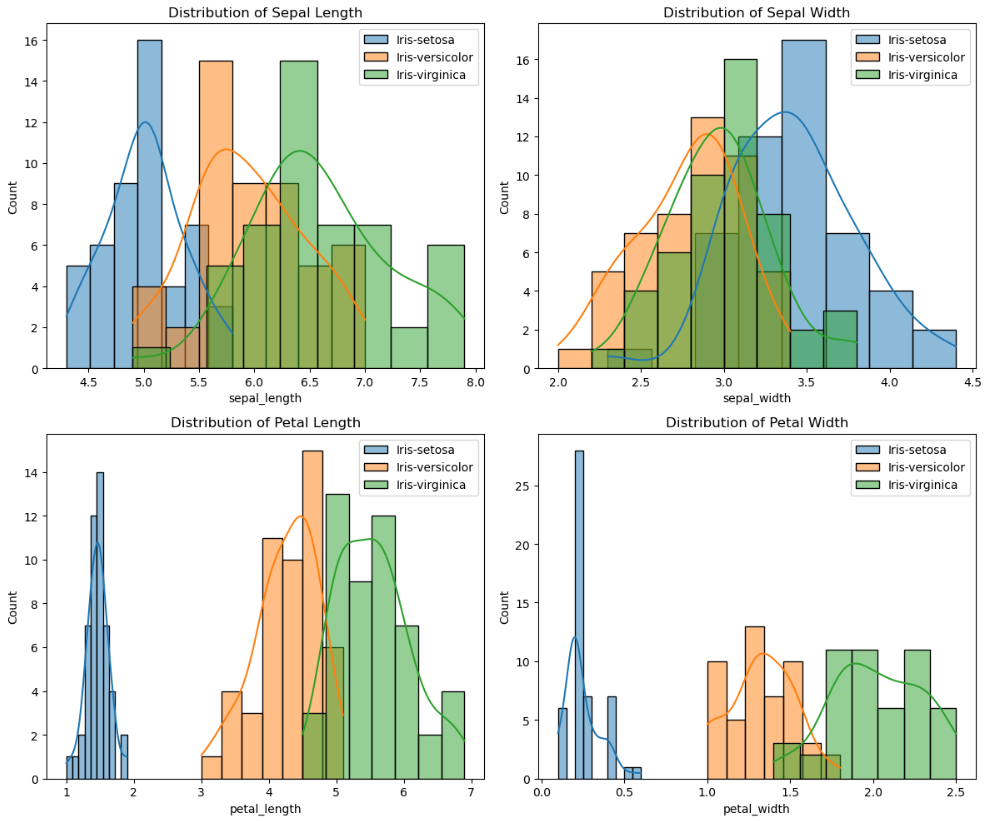
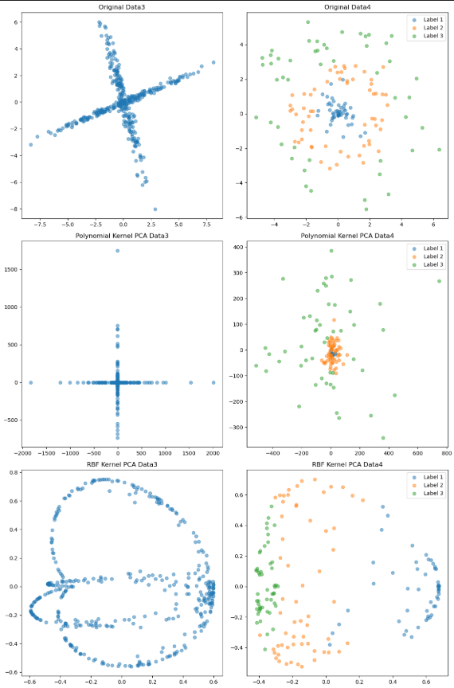
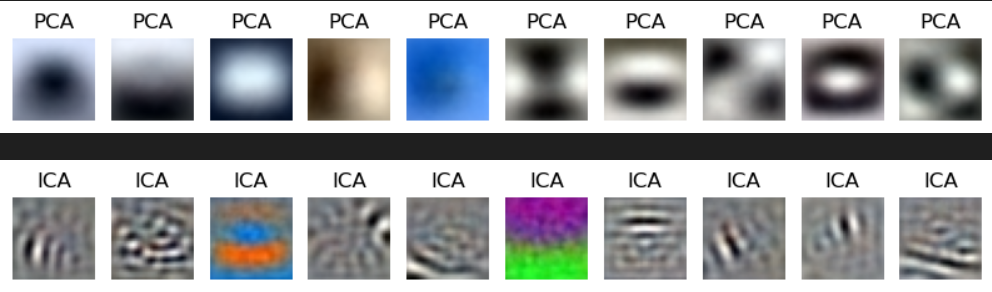

## Unsupervised Techniques

7 exercise projects to learn basics of Unsupervised machiine learning techniques and follow the lectures of Machine Learning Unsupervised Techniques.

- Estimation Theory, Fisher information, CRLB
- Maximum Likelihood
- PCA
- PCA, Kernel PCA
- ICA
- Factor Analysis
- Scaling and Projection Methods

